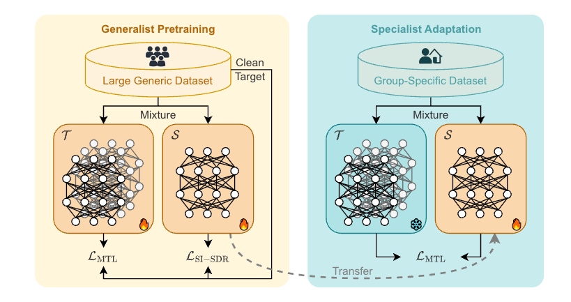

# TGIF: Talker Group-Informed Familiarization of Target Speaker Extraction

TGIF! I wish... Anyways, welcome to the official implementation of our WASPAA 2025 paper:
**“TGIF: Talker Group-Informed Familiarization of Target Speaker Extraction”**
by [Tsun-An Hsieh](https://alexiehta.github.io/) and [Minje Kim](https://minjekim.com)
🗓️ *WASPAA 2025, Tahoe City, CA – October 12–15, 2025*

<div align="center">
  
</div>


##  🔍 Overview

**TGIF** introduces a new paradigm in target speaker extraction (TSE): instead of personalizing to a single user, we adapt a compact model to a group of speakers — like a family. Using a knowledge distillation framework, a lightweight student learns from a generalist teacher’s pseudo-labels, enabling efficient, clean-free adaptation to a small speaker group.

This repository includes:

* Preprocessing scripts for dataset generation
* Training pipelines for teacher and student models
* Adaptation procedure using TGIF


## 📦 Dataset Preparation

This implementation uses the **pDNS subset** of the [DNS Challenge 2024 dataset](https://github.com/microsoft/DNS-Challenge).

### Step 1: Download Dataset

Follow instructions from the [DNS Challenge GitHub](https://github.com/microsoft/DNS-Challenge) to download the pDNS subset.

### Step 2: Generate Training & Evaluation Sets

```bash
# Generate training and validation splits
bash generate_dataset.sh

# Generate test set used for TGIF evaluation
bash generate_test_dataset.sh
```


## 🚀 Training & Adaptation

### Train Teacher Models

* **TD-SpeakerBeam**:

  ```bash
  python train_tdsb.py --config config/config_tdsb.yaml
  ```
* **SpEx+**:

  ```bash
  python train_spex_plus.py --config config/config_tdsb.yaml
  ```

> 🔍 Additional training configurations for student models can be found in the `config/` directory.

### TGIF Adaptation Procedure

1. Generate teacher model outputs.
2. Run TGIF adaptation:

   ```bash
   python adapt_tdsb.py --config config/config_adapt.yaml
   ```


## 📖 Citation

If you find this work helpful, please cite our paper:

**APA Format:**

> Tsun-An Hsieh and Minje Kim,
> *"TGIF: Talker Group-Informed Familiarization of Target Speaker Extraction,"*
> Proceedings of the IEEE Workshop on Applications of Signal Processing to Audio and Acoustics (WASPAA),
> Tahoe City, CA, Oct. 12–15, 2025.

**BibTeX:**

```bibtex
@inproceedings{hsieh2025waspaa,
  title={TGIF: Talker Group-Informed Familiarization of Target Speaker Extraction},
  author={Tsun-An Hsieh and Minje Kim},
  booktitle={Proc. of the IEEE Workshop on Applications of Signal Processing to Audio and Acoustics (WASPAA)},
  year={2025}
}
```